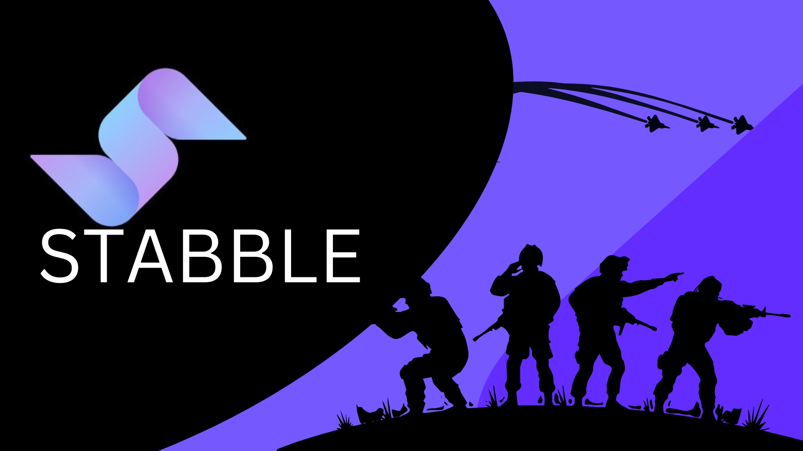
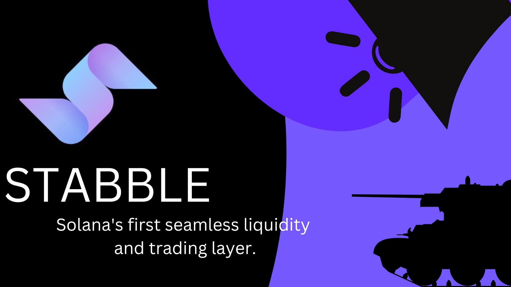

# 🚨 MAYDAY! MAYDAY! Liquidity Under Fire! 🚨

DeFi isn’t for the weak. Liquidity providers (LPs) battle impermanent loss, traders dodge slippage bullets, and arbitrageurs scrape for profits.

But Stabble just dropped heavy artillery—a game-changing update built for the trenches. If you’re serious about optimizing liquidity and maximizing earnings, this is for you.

What’s Happening?

AMMs (Automated Market Makers) are the backbone of DeFi, but they’re far from perfect. Liquidity often gets wasted, traders overpay on swaps, and LPs suffer from impermanent loss.

The Stabble Trenches update changes that. It rewires liquidity, optimizes arbitrage, and reduces risk, making the DeFi battlefield more efficient than ever.

🛡️ Liquidity Providers, This One’s for You!

If you're providing liquidity, you’re no longer fighting blind. Stabble introduces three major upgrades:

Concentrated Liquidity 2.0 – Stop spreading funds too thin. Now, liquidity is placed exactly where it earns the most fees.

Margin Liquidity – Boost returns with leverage while minimizing liquidation risks.

Smart Liquidity Routing – Your liquidity automatically shifts to the best-paying pools, so your capital is always working.

⚔️ Arbitrage Traders, It’s Feast Time!

Smart Liquidity Arbitrage (SLA) – Forget racing bots. Built-in arbitrage mechanisms now hunt price mismatches for you.

Single-Asset Liquidity – Deposit one asset instead of pairs, making LPing simpler.

Dynamic Risk Control – Impermanent loss is minimized, capital efficiency is maximized.

💥 Why Does This Matter?

Because profitability in DeFi is a war, and Stabble just dropped new weapons:

✅ Traders get better execution at lower costs.
✅ LPs earn more with smarter liquidity placement.
✅ Capital moves efficiently, reducing waste and unnecessary risks.

🚀 The Bottom Line

DeFi evolves. You either adapt or get left behind.

The Stabble Trenches update is your frontline strategy for smarter, safer, and more profitable liquidity provision.
